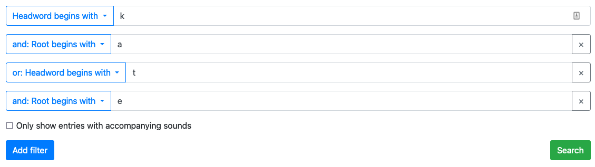

# Mesolex: how does it work?

Mesolex is essentially an app that translates HTML form inputs into queries to a Postgres database.

Users can compose complex queries with the form interface, and the options given in the form inputs are tailored for the datasets they're searching. To achieve this, the forms are dynamically generated with [React](https://reactjs.org). The options for the forms are specified with language configuration data, and the number of forms on the page is controlled by user interactions.

Tools from the Django backend framework are used to transform form submissions into database queries. Each individual submitted "filter" is processed as a [Django form](https://docs.djangoproject.com/en/3.0/topics/forms/), and the total collection of submitted filters is processed as a [Django formset](https://docs.djangoproject.com/en/3.0/topics/forms/formsets/). Form submissions are translated into [Django queryset expressions](https://docs.djangoproject.com/en/3.2/topics/db/queries/), which become queries to the Mesolex database.

The Mesolex database has a simple schema. Lexical data is stored as JSON documents in the `Entry` table. This table is queried by means of two supplementary tables with fast indexes. The `SearchableString` table is used for short strings (e.g. headwords, roots, orthographic variants) and has a [GIN index](https://www.postgresql.org/docs/current/gin.html). The `LongSearchableString` is used for fuzzy text search on extended prose, and it stores text search vector data with a GIN index.

## An example query in detail

The different pieces of Mesolex's query system can be understood by following a single query through the request-response cycle.

### Form submission → formset

Suppose the user submits this example query:



The submitted form data will end up on a `request` object that is handled by a Django view. Any view that calls `query_builder.utils.SearchContextBuilder.search_context` on the request will be able to handle the query and return search results. (In this case, the view is controlled by a Wagtail page (`mesolex_site.models.SearchPage`), but this isn't essential.)

Given a request, `SearchContextBuilder.search_context` will instantiate a formset on the request and use it to generate a query. The formset will be some subclass of `query_builder.forms.QueryBuilderBaseFormset`, and the query will be generated by calling its `get_full_queryset` method. The *particular* formset class is dataset-specific – it is looked up by calling `lexicon.forms.formset_for_dataset`, which will return a formset class from `lexicon.forms` (e.g. `lexicon.forms.azz.AzzLexicalSearchFilterFormset`).

### Formset → forms → queryset

A formset basically groups together a collection of forms into a single form-like entity that can have its own validation logic and functionality. In the above image, each individual input corresponds to a single form, and the total set of inputs corresponds to a formset. Each input is an entire form because it actually comprises *several* pieces of data, and the whole collection is a formset because there can be arbitrarily many forms.

The formset's `get_full_queryset` method runs validation on each individual form, and then it uses two helper classes to group the form data together into a combined expression that respects operator precedence. When the user submits an input like "and: Root begins with: a" in the above, this becomes a `CombiningQuery`, a [named tuple](https://docs.python.org/3/library/collections.html#collections.namedtuple) containing the "and" operator and the query. The `QuerysetGrouper` then groups the queries together into a single query with correct operator precedence (with "and" binding tighter than "or").

Global filters (e.g. "only show results with audio") are applied at the queryset level.

#### Form → query

Each individual form becomes an individual query expression represented as a Django [Q object](https://docs.djangoproject.com/en/3.2/topics/db/queries/#complex-lookups-with-q-objects). The query is constructed in the `QueryBuilderForm._get_query` method.

`_get_query` will call `QueryBuilderForm.get_filter_action_and_query` to produce a "filter action" (something like "starts with", "ends with", "matches regex") and a query string. These may either be a direct translation of the user's input or the result of processing through a sequence of *transformations* (see below). `_get_query` will determine whether to use the `SearchableString` table or the `LongSearchableString` table to query the datasets, and it will then construct the Q object appropriately.

##### Filter actions

The range of possible filter actions is not language-specific. It is given by `QueryBuilderForm.FILTERS_DICT`. This dictionary translates the string descriptors of filter actions given by the frontend (e.g. `begins_with`) into valid components of Django query expressions (e.g. `__startswith`).

##### Transformations

Transformations are functions that change a "simple" query (e.g. "and: Roots begins with: a") into one that has some special logic (e.g. "with vowel length neutralization").

A transformation is specified by defining a string-to-string function and applying the `mesolex.utils.transformation` decorator:

```python
@transformation(data_field='vln')
def to_vln(query_string):
    return re.sub(r'([aeiouAEIOU]):?', r'\1:?', query_string)
```

The argument to `transformation` specifies the field in the form to watch for to determine whether the transformation gets applied. In the above, for example, the `to_vln` transformation will only be applied if the field `vln` is selected in the form.

By nature, queries that have had a transformation applied have to become regular expression queries, since that's the only type of query that's flexible enough to accommodate the wide open range of transformations. For this reason, the "filter action" of a query that has had a transformation applied will always be `__iregex`.

#### Queries → queryset

Once each form has generated its Q object, the formset inserts it into a `CombiningQuery` along with its combining operator ("and", "or not", etc), and the `QuerysetGrouper` glues the Q objects together into a queryset.

The queries are combined in such a way as to take advantage of the database's indexes. All expressions combined with "and" are first rolled up into a single queryset by iteratively calling `.filter`, which translates into a series of SQL JOINs. The resulting querysets are then combined into a single SQL query by iteratively calling `.union`, which translates into UNION in SQL.

**Note:** this style of combining queries was chosen in order to take advantage of the GIN indexes in the database. If "or" queries were combined by OR expressions in the SQL (= combining Q objects with `|` operators), the index could not be used. When disjunction is involved, it's actually more efficient to perform several queries and union them together than to create a single combined query!

### Search results

Once the queryset has been constructed, `SearchContextBuilder.search_context` paginates the results and ships the data to its caller for display.

In general, the data will be passed to a template rendering function that will display the results using a Django template.